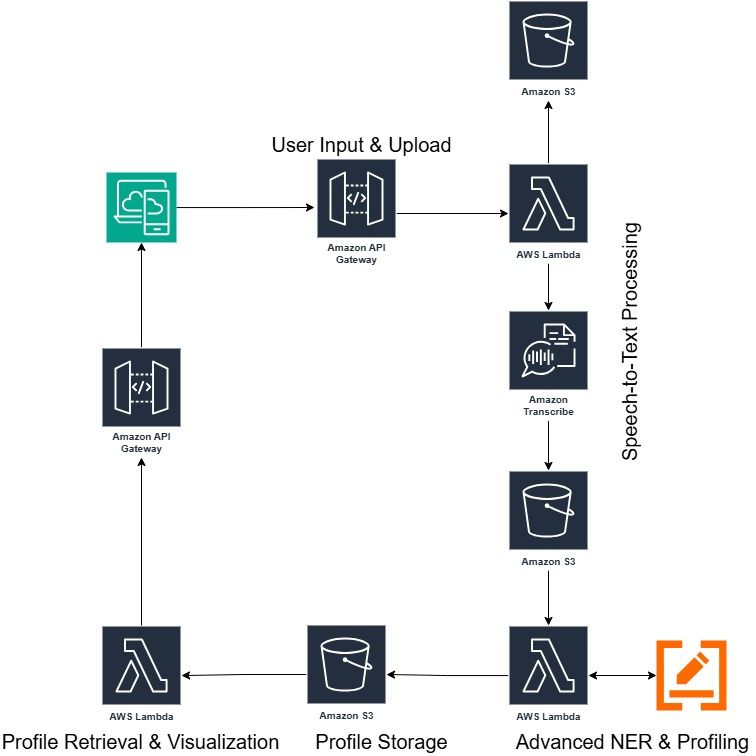

# AI Voice Onboarding on AWS - Bachelor's Thesis Project

<p align="center">Academic Year 2024/2025</p>

## Overview

This project was developed for the bachelor's thesis **"Evaluating NER Methods in AI Voice Onboarding on AWS"**, in collaboration with **Hindeep S.r.l.**, within the **Artificial Intelligence** bachelor's degree program.

The goal is to turn a spoken self-description into a **structured, editable dating profile**. The prototype combines an HTML/CSS/JavaScript frontend with an **AWS serverless backend**, integrating speech-to-text conversion and domain-specific **Named Entity Recognition (NER)**.

The thesis examines **Amazon Comprehend**, **fine-tuned Italian BERT**, and **zero-shot LLM extraction**, selecting the LLM-based approach for the voice-onboarding prototype.

---

## Demo

The video demonstrates the recorded prototype: voice recording, audio submission, profile generation, and interactive editing of profile fields and personality sliders.

🔊 **Enable audio for the full demonstration.**

https://github.com/user-attachments/assets/e41ca2cb-ba13-4ea9-b215-e5d4ed8bb0dd

---

## Objectives

- Build a voice-based alternative to conventional profile-registration forms.
- Integrate audio capture, transcription, and structured information extraction.
- Compare NER approaches for domain-specific Italian self-descriptions.
- Display extracted information in an editable profile with an interactive personality radar chart.

---

## System Architecture

<p align="center">
  
</p>

The browser records audio and sends it as a Base64-encoded JSON payload through **Amazon API Gateway**. A Lambda function stores the audio in **Amazon S3** and starts an asynchronous **Amazon Transcribe** job. The resulting transcription triggers LLM-based extraction, and the structured profile is saved in S3 and retrieved through a second API endpoint.

### Backend Components

| Function | Responsibility |
|---|---|
| `backend/upload_and_transcribe.py` | Receive audio, upload it to S3, and start Italian speech-to-text transcription. |
| `backend/extract_entities.py` | Read the transcription, request a structured profile through OpenRouter, and store the JSON result. |
| `backend/get_profile.py` | Retrieve the latest available profile and return it to the frontend. |

The upload-only function in `legacy/` is an earlier implementation, not an additional step in this three-function workflow.

### Frontend

The reference frontend consists of **two separate pages**: `frontend/index.html` for recording and submission, and `frontend/profile.html` for manually loading and editing the generated profile. Personality sliders update a **Chart.js radar chart**.

---

## NER Approaches and Findings

| Approach | Role in the project |
|---|---|
| **Amazon Comprehend** | Evaluated in the thesis as a managed-service option; not adopted in the prototype. |
| **Fine-tuned BERT** | `dbmdz/bert-base-italian-cased` adapted to custom entity labels using a synthetic Italian IOB corpus generated with Gemini. |
| **Zero-shot LLM** | Prompt-based extraction and normalization into JSON, selected for the onboarding workflow. |

The preserved BERT notebook reports a **weighted validation F1-score of approximately 0.8031** on its synthetic-data split. The thesis also presents qualitative examples comparing BERT and LLM extraction on temporal context and negation. These examples are **not a shared quantitative benchmark** across all approaches.

The synthetic corpus is included in `research/data/frasi_gemini.txt`; BERT training and exploratory analysis are documented in `research/bert_ner.ipynb`. BERT training is separate from the LLM-based application pipeline.


---

## Repository Structure

```text
ai-voice-onboarding-aws/
|-- backend/
|   |-- upload_and_transcribe.py
|   |-- extract_entities.py
|   `-- get_profile.py
|-- docs/
|   |-- Thesis.pdf
|   |-- Presentation.pdf
|   `-- assets/
|       `-- architecture.jpg
|-- frontend/
|   |-- index.html
|   `-- profile.html
|-- media/
|   |-- onboarding-demo.mp4
|   `-- onboarding-preview.png
|-- research/
|   |-- bert_ner.ipynb
|   `-- data/
|       `-- frasi_gemini.txt
|-- README.md
```

---

## Reproducibility and Prototype Status

This repository documents a **research prototype**, not a preconfigured or production-ready deployment. The full workflow requires separately configured AWS resources, API Gateway routes, S3 event notifications, IAM permissions, and an OpenRouter API key. Infrastructure templates and trained BERT weights are not included.

---

## Documentation

- [Bachelor's thesis](docs/Thesis.pdf)
- [Thesis presentation](docs/Presentation.pdf)
